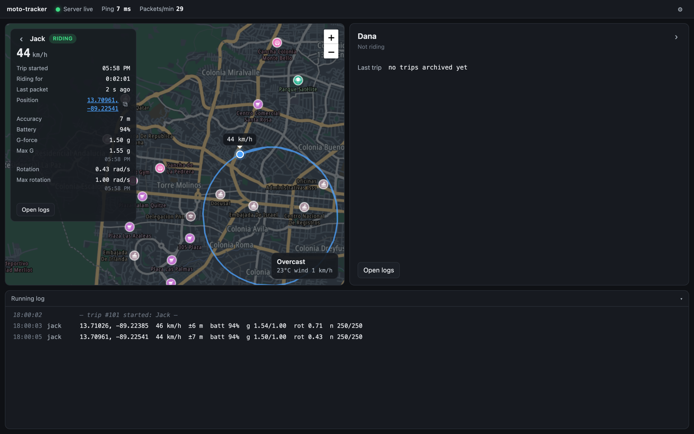
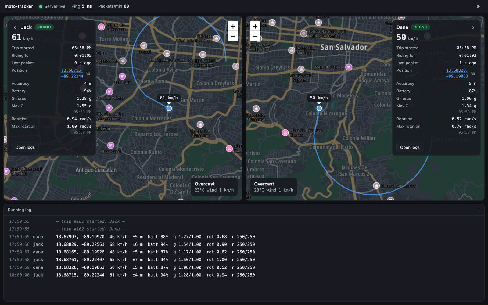
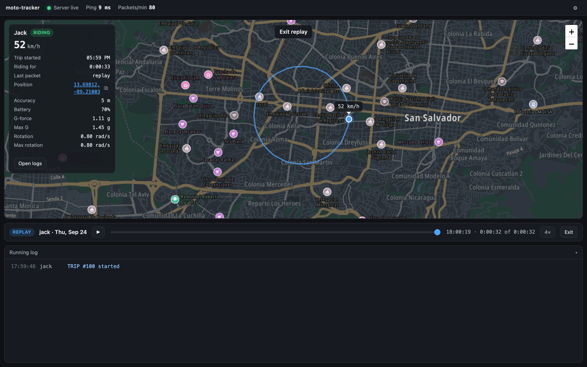
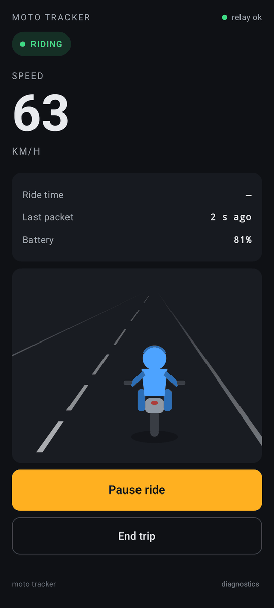
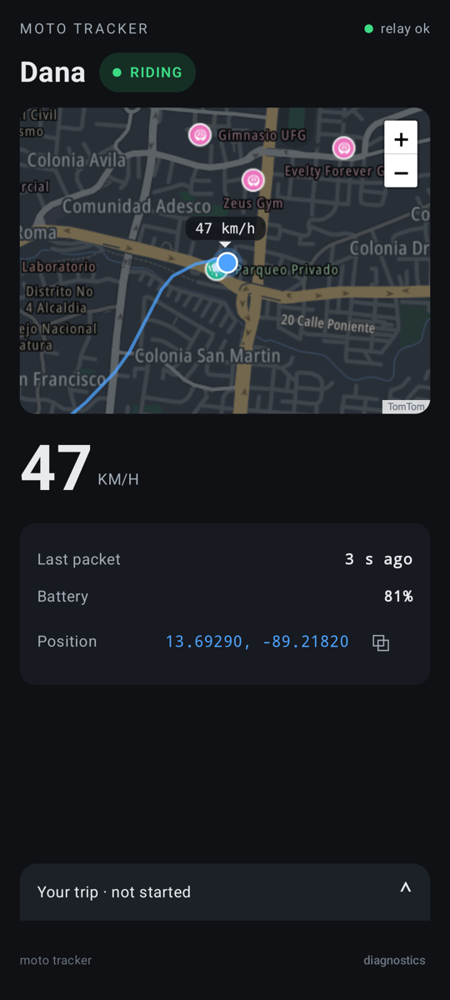
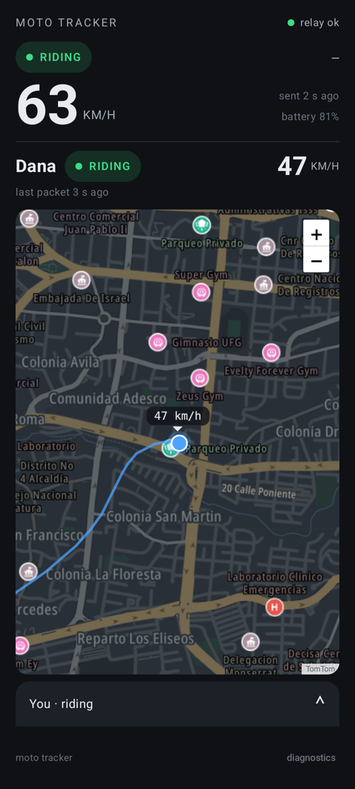

# moto-tracker

> [!CAUTION]
> ## ⚠️ The crash detection is UNTESTED. Do not rely on it. Not you, not anyone, not ever.
>
> This project includes code that tries to detect a motorcycle crash and raise an alarm.
> **That code has never been tested against a real crash.** There is no crash data, and
> nobody is going to crash on purpose to make some. It has only been tuned to stay quiet
> during normal riding, which is **not** evidence that it will fire during a crash.
>
> It can and should be expected to:
>
> - **miss a real crash completely**, and never raise any alarm;
> - **raise alarms when nothing is wrong**;
> - **fail silently**: dead battery, no signal, the phone's OS killing the app, a server
>   outage, an expired key, a bug, or any of a hundred other things.
>
> **This is not a safety device.** It is not an emergency service, a medical device, a
> crash detector you can trust, or a substitute for any of those. It does not contact
> emergency services. **Do not use it, or let anyone else use it, as a reason to believe
> that a crashed rider will be found or helped.** If your safety or anyone else's
> depends on crash detection, use a certified commercial product and still take the
> ordinary precautions.
>
> It is a personal hobby project, published so people can read the code. It comes with
> **no warranty of any kind** (see [LICENSE](LICENSE)), and the author accepts no
> liability for anything that happens, or fails to happen, because of it.

---

A private, self-hosted live tracker for two motorcyclists who ride together or apart.
Each rider's Android phone reports position and motion to a small relay server. A Mac
monitor at home shows both riders live, keeps the trip archive, and lets you replay
past rides. Each phone also acts as an **Observer** for the other rider.

The names in the screenshots and test data ("Jack" and "Dana") are made up, and so is
the demo route.

## Screenshots

### Desktop monitor (macOS)

**One rider out:** live map, speed, forces and a running telemetry log.



**Both riders out:** a pane for each rider.



**Replay:** play back any archived trip on a timeline.



### Android app

| Rider Mode | Observer Mode | Hybrid Mode |
|:---:|:---:|:---:|
|  |  |  |
| This phone is on a trip. The road runs at the speed being ridden | The other rider is out, and this phone watches | Both riders are out at once |

*The Android images come from the app's automated layout test on made-up data. The
maps and the road animation were added afterwards, drawn by the app's own map page
and scene code.*

## How it fits together

```
 Android phone (rider A) ─┐                        ┌─> Mac monitor: live map, alarm,
                          ├──> relay (small VPS) ──┤    trip archive, replay
 Android phone (rider B) ─┘                        └─> the other phone, as Observer
```

| Folder | What it is |
|---|---|
| `android/` | Kotlin/Jetpack Compose app. Rider, Observer and Hybrid modes, sensor sampling, the (untested) crash detector in `Detector.kt` |
| `relay/` | Python relay: pairing, live state, trips and incidents. Runs on a small VPS behind HTTPS |
| `monitor/` | Python monitor for the Mac: web UI, alarm, archive, replay, map tiles |
| `app/` | Small Swift wrapper app for macOS |
| `server/` | Earlier single-machine server from the prototyping phase |
| `analysis/` | Scripts that work out each rider's baseline from the ride archive |

## Try the monitor without any hardware

The demo starts a throwaway relay and monitor in a temporary directory and sends them a
made-up ride. It touches nothing real, and it only needs the Python that ships with macOS:

```bash
/usr/bin/python3 monitor/demo.py --both
```

Then open the URL it prints. Other flags: `--idle`, `--incident 25` (a simulated crash
alarm), `--drop 20` (one rider's data stops arriving). The map needs a TomTom API key
(see `monitor/config.py`). Everything else works without one.

## Tests

```bash
/usr/bin/python3 relay/both_riding_test.py
/usr/bin/python3 monitor/e2e_test.py
cd android && ./gradlew testDebugUnitTest
```

These test the software's plumbing. **None of them shows that a crash would be
detected** (see the warning at the top).

## Configuration notes

This was built for one household's setup, and it shows. Server addresses in the code
are placeholders from documentation-reserved ranges (`203.0.113.x`, `100.64.0.x`).
Before running this for real you'd need to set your own relay address, TLS
certificate, pairing and API keys. No secrets are included in this repository.

## License

MIT. See [LICENSE](LICENSE). Read the warning at the top again before you do anything
with this.
